## Nginx

### Instalacion

```bash
$sudo apt install nginx
```

Directorio de configuracion */var/www/html*
Aqui se encuentra el archivo *.index* que carga nginx

Cambiar el propietario del directorio al usuario con:

```bash
#Comentarios /var/www/html$
sudo chown minimini:minimini .
```

### Desinstalación de Nginx

```Bash
sudo apt-get remove --purge nginx
sudo rm -r /etc/nginx
sudo systemctl daemon-reload
```
    sudo apt-get remove --purge nginx: Elimina el paquete de Nginx y sus archivos de configuración.
    sudo rm -r /etc/nginx: Elimina el directorio de configuración de Nginx.
    sudo systemctl daemon-reload: Recarga la configuración de systemd para reflejar los cambios.

### Desactivar Nginx:

Para detener y desactivar Nginx, ejecuta los siguientes comandos:

```bash
sudo systemctl stop nginx   # Detiene el servicio inmediatamente
sudo systemctl disable nginx # Evita que se inicie automáticamente al reiniciar
```

### Activar Nginx:

Para volver a iniciar Nginx, ejecuta:

```bash
sudo systemctl start nginx  # Inicia el servicio
sudo systemctl enable nginx  # Permite que se inicie automáticamente al reiniciar (si lo necesitas)
```

Video tutorial            https://www.youtube.com/watch?v=xLPh_3VquH0

---

## Mariabd v 1:10.11.6-0+deb12u1

### Instalacion

```bash
sudo apt install mariadb-server
```

    Iniciar:
```Bash
sudo systemctl start mariadb
```

Detener:

```Bash
sudo systemctl stop mariadb
```

Reiniciar:

```Bash
sudo systemctl restart mariadb
```

Ver estado:

```Bash
sudo systemctl status mariadb
```

Habilitar inicio automático:

```Bash
sudo systemctl enable mariadb
```

Deshabilitar inicio automático:

```Bash
sudo systemctl disable mariadb
```


---


## PHP 2:8.2+93

### Instalacion

```bash
sudo apt install php-fpm php-mysql
```
#### php8.2-gd

La instalación de php8.2-gd es fundamental para habilitar la extensión GD en PHP 8.2, que es una biblioteca de procesamiento de imágenes. 
Esta extensión permite que PHP manipule y genere imágenes directamente desde el código, algo esencial para muchas aplicaciones web, incluyendo WordPress

```bash
sudo apt install php8.2-gd
```

Tambien editar el archivo que se encuentra en : `/etc/php/8.2/fpm/php.ini `

```
sudo nano /etc/php/8.2/fpm/php.ini
```

Modificar la siguiente lienea 
Busca la línea: `;extension=gd` y elimina el ";" para habilitarla:

```
; Antes
;extension=gd

; Después
extension=gd
```

¿Por qué es necesaria en WordPress?

WordPress depende de GD para:

    Generar miniaturas automáticas al subir imágenes a la biblioteca multimedia.

    Mostrar imágenes en el editor (si GD no está habilitado, las imágenes no se procesan y aparecen rotas).

    Funcionamiento de temas y plugins que usan galerías, sliders, o edición básica de imágenes.

---

## wordpress 

### Instalacion

Descargar .tar.hz en el directorio */var/www/*

```bash
sudo wget https://wordpress.org/latest.tar.gz
```

Descomprimir el archivo:

```bash
sudo tar -xzvf latest.tar.gz
```

Cambiar persmisos de grupos

```bash
#/var/www
sudo chown -R www-data:www-data wordpress
```

---

## Configuracion de nginx con wordpress

```bash
cd /etc/nginx/sites-available
```

Con cualquier editor hacer la configuracion en la linea 2 donde dice:
*server unix:/var/run/php/php7.4-fpm.sock;*
cambiar la version de php por la que tengamos en este momento es de *8.2* y la linea quedaria asi:
*server unix:/var/run/php/php8.2-fpm.sock;*

```bash
#/etc/nginx/sites-available$
sudo nano wordpress.conf
```

Para crear el archivo wordpress.conf


```
upstream wp-php-handler {
        server unix:/var/run/php/php7.4-fpm.sock;
}
server {
        listen 80;
        server_name _;
        root /var/www/wordpress/;
        index index.php;
        location / {
                try_files $uri $uri/ /index.php?$args;
        }
        location ~ \.php$ {
                include snippets/fastcgi-php.conf;
                fastcgi_pass wp-php-handler;
        }
}
```


Eliminar el archivo de default que se encuentra en: /etc/nginx/sites-available
Crear enlase simbolico 

```bash
#/etc/nginx/sites-available$
sudo ln -s /etc/nginx/sites-available/wordpress.conf /etc/nginx/sites-enabled
$cd /etc/nginx/sites-enabled
$ls
```
Estara el enlace simbolico tambien eliminaremos el archivo default de este directorio

```bash
#/etc/nginx/sites-enabled
sudo rm default
```

Reiniciar el servidio de nginx con systemctl:

```bash
$sudo systemctl reload nginx
```

Luego de esto nos dirigimos a la direccion del servidor en este caso 192.168.0.27 (o donde se encuentre la raspberry)
Sleccionamos el idioma, luego volvemos a la terminal y seguimos los pasos para crear la base de datos:

Para crear base de datos / tabla en MariaDB

```bash
sudo mariadb
```

Ahora tipeamos sentencia por centencia:

```sql
create database wordpress default character set utf8 collate utf8_unicode_ci;

create user 'wpuser'@'localhost' identified by 'wpbase1@';

grant all privileges on wordpress.* TO 'wpuser'@'localhost';

flush privileges;

exit
```
Volvemos a la pagina 192.168.0.27 (o donde este la raspberry) y completamos los datos de base de datos que creamos anteriormente con mariadb.

nombre: wordpress
nombre usuario: wpuser
contraseña: wpbase1@
servidor de la base de datos: localhost
prefijo de la tabla: (lo dejamos de default)


Luego de que se instale llenar los campos:

Titulo del sitio: Hcaiendo cosas raras
nombre usuario: mariano
contraseña: CBO4df$7$X04B(fOT3
tu correo: 2022lg@gmail.com
visibilidad en motores de busqueda: v

---

## Manejando procesos y alias

#### Para usar WordPress (y Nginx):

```bash
sudo systemctl stop dnsmasq #(y sudo systemctl stop lighttpd si lo tienes)
sudo systemctl start nginx

```

#### Para usar Pi-hole:

```bash
sudo systemctl stop nginx
sudo systemctl start dnsmasq #(y sudo systemctl start lighttpd si lo tienes)
```

## Alias activar y desactivar servicio de pihole y nginx

```bash
alias nginx_on='sudo systemctl stop dnsmasq && sudo systemctl start nginx'
alias nginx_off='sudo systemctl stop nginx'
alias pihole_on='sudo systemctl stop nginx && sudo systemctl start dnsmasq'
alias pihole_off='sudo systemctl stop dnsmasq'
```

#### Para iniciar WordPress:

```bash
alias start_wordpress='sudo systemctl start mariadb && sudo systemctl start php7.4-fpm && sudo systemctl start nginx'
```
#### Para detener WordPress:

```bash
alias stop_wordpress='sudo systemctl stop nginx && sudo systemctl stop php7.4-fpm && sudo systemctl stop mariadb'
```
#### Para iniciar Pi-hole (asumiendo que solo tienes dnsmasq):

```bash
alias start_pihole='sudo systemctl start dnsmasq'
```

#### Para detener Pi-hole:

```bash
alias stop_pihole='sudo systemctl stop dnsmasq'
```

#### Para detener todo (excepto lo esencial del sistema):

```bash
alias stop_all='sudo systemctl stop nginx && sudo systemctl stop php7.4-fpm && sudo systemctl stop mariadb && sudo systemctl stop dnsmasq'
```

*systemctl is-enabled service*: Este comando verifica si un servicio está habilitado para iniciarse al arrancar el sistema y devuelve enabled o disabled.

*systemctl is-active service*: Este comando verifica si un servicio se está ejecutando actualmente y devuelve active o inactive.

---

## **Estructura de directorios de WordPress** (en tu Raspberry Pi):

La instalación típica en `/var/www/html/` (o donde hayas configurado Nginx) tiene esta estructura:

```
/var/www/html/
├── wp-admin/          # Archivos del panel de administración
├── wp-content/       # Contenido personalizado (plugins, temas, archivos subidos)
│   ├── plugins/      # Plugins instalados
│   ├── themes/       # Temas (plantillas) de WordPress
│   └── uploads/      # Archivos que subes (imágenes, PDFs, etc.) → Aquí están tus archivos
├── wp-includes/      # Archivos del núcleo de WordPress
├── index.php         # Archivo principal
└── (otros archivos como .htaccess, wp-config.php, etc.)
```

---

### **¿Dónde están tus archivos subidos?**

- Cuando subes un archivo (ej: una imagen) desde el administrador de WordPress (`/wp-admin`), se guarda en:

```
/var/www/html/wp-content/uploads/
```

- WordPress **organiza los archivos por año y mes** (ej: `uploads/2024/05/imagen.jpg`), pero esto es configurable.

---

### **¿Por qué no hay un directorio con el nombre "Haciendo cosas raras"?**

- WordPress **no crea carpetas con el nombre del sitio**, ya que todo el contenido (posts, páginas, ajustes) se guarda en **la base de datos (MariaDB)**. Solo los archivos multimedia van a `wp-content/uploads/`.
- El nombre del sitio es un campo en la base de datos (tabla `wp_options`, opciones `blogname` y `blogdescription`).

---

### **Cómo verificar tus archivos subidos:**

1. **Por SSH**:

```bash
ls -l /var/www/html/wp-content/uploads/
```

Verás subcarpetas por año/mes si no has desactivado la opción.

2. **Desde el administrador de WordPress**:

- Ve a `Medios → Biblioteca`. Allí verás los archivos y su ruta relativa (ej: `/wp-content/uploads/2024/05/imagen.jpg`).

---

### **¿Quieres cambiar la ubicación de los archivos?**

Puedes modificarlo en `wp-config.php` con:

```php
define('UPLOADS', 'ruta/personalizada');
```
Pero requiere ajustar permisos y configurar Nginx para que sirva los archivos desde allí.

---

### **Resumen:**

- **El nombre del proyecto no define carpetas**. Todo está en `/var/www/html/` (o tu ruta de instalación).
- **Base de datos (MariaDB)**: Guarda el contenido textual (posts, nombre del sitio, etc.).
- **Archivos subidos**: Siempre en `wp-content/uploads/`.

---

## **Guía Didáctica: WordPress, Backups y GitHub (Explicado desde Cero)**

**Objetivo:** Que entiendas **exactamente** cómo funciona tu sitio de recetas, dónde se guarda cada cosa y cómo protegerla.  

### **1. ¿Cómo funciona WordPress?**  

#### **(A) Dos partes FUNDAMENTALES** 
 
1. **📁 Archivos del sistema** (en `/var/www/html/`):  
   - Código de WordPress (core).  
   - Plugins y temas.  
   - Configuraciones (como el tema activo).  

2. **🗃️ Base de datos (MariaDB/MySQL)**:  
   - **Aquí están TUS RECETAS** (títulos, textos, categorías).  
   - También guarda: usuarios, comentarios, ajustes.  

#### **(B) ¿Dónde está cada cosa?**  

| **Tipo de dato**      | **Ubicación física**                | **¿Va al repo de GitHub?** |  
|-----------------------|-------------------------------------|----------------------------|  
| **Recetas (texto)**   | Base de datos (tablas)              | ❌ No (se backup aparte)    |  
| **Imágenes**          | `/wp-content/uploads/`              | ❌ No (backup aparte)       |  
| **Plugins**           | `/wp-content/plugins/`              | ✅ Solo los personalizados  |  
| **Temas**             | `/wp-content/themes/`               | ✅ Solo los editados por ti |  
| **Configuración**     | `wp-config.php` (NO), Nginx (SÍ)    | ✅ Solo archivos seguros    |  


### **2. ¿Qué guardar en GitHub?**  

**📍 Directorio inicial:** `/var/www/html/` (ahí ejecutas `git init`).  

#### **(A) Archivos que SÍ van al repo**  

- `/wp-content/themes/mi-tema-recetas/` (si lo creaste/modificaste).  
- `/wp-content/plugins/mi-plugin-recetas/` (si lo programaste).  
- `/etc/nginx/sites-available/tu-sitio` (config de Nginx).  

#### **(B) Archivos que NO van al repo**
 
- `wp-config.php` (¡tiene contraseñas!).  
- `/wp-content/uploads/` (imágenes de recetas).  
- **Nada de la base de datos** (las recetas van en backup aparte).  

#### **(C) Comandos básicos**  

```bash
cd /var/www/html/          # Entra a la carpeta de WordPress
git init                   # Inicia el repo
git add .                  # Añade archivos (menos los ignorados)
git commit -m "Primer backup de configs"
git remote add origin https://github.com/tuusuario/turepo.git
git push -u origin main    # Sube a GitHub
```

### **3. ¿Cómo hacer backup de las recetas?**  

**Necesitas esto porque GitHub NO guarda la base de datos.**  

#### **(A) Backup manual (1 comando)**  

```bash
mysqldump -u usuario_bd -p nombre_bd > backup_recetas.sql
```

- **Dónde encontrar los datos:**  
  - `usuario_bd` y `nombre_bd` están en `/var/www/html/wp-config.php`.  
  - Te pedirá la contraseña (la misma de la BD).  

#### **(B) ¿Dónde guardar el backup?**  

- **USB, Google Drive, o otro servidor.**  
- **No lo subas a GitHub** (por tamaño y seguridad).  

### **4. Resumen gráfico**  

```mermaid
pie
    title ¿Dónde se guarda cada cosa?
    "Base de datos (recetas)" : 45
    "GitHub (configs/temas)" : 25
    "Backup manual (SQL/imágenes)" : 30
```



### **5. ¿Qué hacer si la Raspberry se rompe?**  

1. **Recuperar configuraciones:** Clona tu repo de GitHub.  
2. **Recuperar recetas:** Usa el archivo `backup_recetas.sql` para importarlas en la nueva BD.  
3. **Recuperar imágenes:** Cópialas desde `/wp-content/uploads/` (si hiciste backup).  


---
