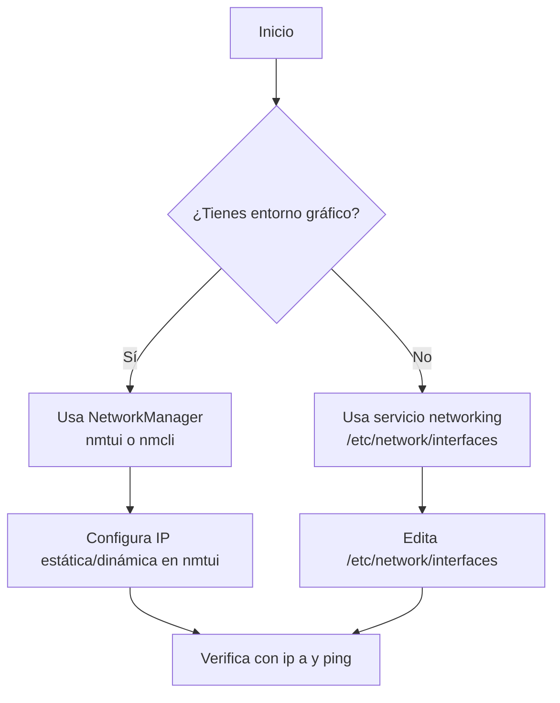

### Guía Completa: Configuración de IP Estática y Dinámica en Debian

**Explicación fundamental:**  
En Debian existen **dos sistemas de gestión de red** que determinan cómo se configuran las IPs:  

1. **Servicio `networking`**  
   - Usado en: Instalaciones mínimas, servidores sin escritorio gráfico.  
   - Archivo de configuración: `/etc/network/interfaces`  
   - Herramientas: `ip`, `ifup`, `ifdown`  

2. **NetworkManager**  
   - Usado en: Sistemas con entorno gráfico (GNOME, KDE, etc.).  
   - Archivos de configuración: Almacenados en `/etc/NetworkManager/`  
   - Herramientas: `nmtui` (terminal), `nmcli` (comandos), interfaz gráfica.  


### Paso 0: Identificar tu Sistema de Red  
**Ejecuta en terminal:** 

```bash
sudo systemctl status networking NetworkManager
```  

- Si ves **`active (running)` en `networking`**: Configura via `/etc/network/interfaces`.  
- Si ves **`active (running)` en `NetworkManager`**: Usa `nmtui` o `nmcli`.  


### Configuración IP Estática  
#### 🔧 Caso A: Servicio `networking` (servidores)  
1. **Editar configuración:**  

   ```bash
   sudo nano /etc/network/interfaces
   ```  
2. **Reemplazar DHCP por:**  
   ```bash
   auto enp0s3
   iface enp0s3 inet static
      address 192.168.1.100/24  # IP/máscara en notación CIDR
      gateway 192.168.1.1
      dns-nameservers 8.8.8.8 1.1.1.1
   ```

3. **Aplicar cambios:** 

   ```bash
   sudo systemctl restart networking
   ``` 

#### 💻 Caso B: NetworkManager (escritorio)  

1. **Abrir interfaz de configuración:** 

   ```bash
   sudo nmtui
   ```

2. **Seguir:**  

   `Edit a connection` → Elegir interfaz → `IPv4 CONFIGURATION: Manual` →  
   Añadir IP, Gateway y DNS.  
3. **Reiniciar conexión:**  
   En `nmtui`: `Activate a connection` → Desactivar/Reactivar la interfaz.  


### Configuración IP Dinámica (DHCP)  
#### 🔧 Caso A: Servicio `networking`  
Editar `/etc/network/interfaces`: 

```bash
auto enp0s3
iface enp0s3 inet dhcp  # Solo esta línea es necesaria
```

#### 💻 Caso B: NetworkManager  
En `nmtui`:

`Edit connection` → `IPv4 CONFIGURATION: Automatic`  


### Verificación (funciona para ambos sistemas)

```bash
# Ver IP asignada
ip -c a show enp0s3

# Probar conexión local
ping 192.168.1.1

# Probar DNS e internet
ping google.com

# Ver rutas
ip route
```


### Solución de Problemas Comunes  
| Problema                     | Solución                          |  
|------------------------------|-----------------------------------|  
| **IP no cambia**             | `sudo systemctl restart networking` o `nmcli con reload` |  
| **Sin conexión a internet**  | Verificar gateway y DNS: `cat /etc/resolv.conf` |  
| **Interfaz no activa**       | `sudo ip link set enp0s3 up`      |  
| **Conflictos entre servicios** | Deshabilitar NetworkManager: `sudo systemctl disable --now NetworkManager` |  


### ¿Por qué dos sistemas?  
- **`networking`**: Ligero, ideal para servidores. Configuración estática en un archivo.  
- **NetworkManager**: Gestiona conexiones móviles, WiFi, VPN. Ideal para dispositivos portátiles.  


### Flujo de Decisión 




### Ejemplos Prácticos  
#### Configurar IP temporal (sin reinicio):

```bash
sudo ip addr add 192.168.1.100/24 dev enp0s3
sudo ip route add default via 192.168.1.1
```

#### Restablecer DHCP rápidamente:  

```bash
sudo dhclient -r enp0s3  # Libera IP actual
sudo dhclient enp0s3      # Solicita nueva IP
```


### Recomendaciones Finales

1. **Servidores:** Siempre usa IP estática + servicio `networking`.  
2. **Laptops:** Usa NetworkManager para manejar redes cambiantes (WiFi/cable).  
3. **Backup:** Antes de editar configuraciones:

   ```bash
   sudo cp /etc/network/interfaces /etc/network/interfaces.bak
   ```

4. **Documentación oficial:**  

   ```bash
   man interfaces     # Para servicio networking
   man nmtui          # Para NetworkManager
   ```


