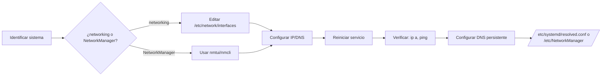

### Guía Maestra: Configuración de Red en Debian (Archivos, DNS y Sistemas)  
**Nota:** Esta guía integra todos los conceptos previos con detalles de archivos clave. Ideal para documentar en Obsidian.  

---

### 📂 Directorio de Archivos Clave de Red  
| Ruta | Sistema | Propósito | Ejemplo |  
|------|---------|-----------|---------|  
| **`/etc/network/interfaces`** | `networking.service` | Configuración principal de interfaces | [Ver ejemplo](#interfaces-example) |  
| **`/etc/NetworkManager/`** | NetworkManager | Perfiles de conexión (`.nmconnection`) | `*.nmconnection` en subdirectorios |  
| **`/etc/resolv.conf`** | *Todos* | **DNS temporal** (¡cuidado! regenerable) | `nameserver 8.8.8.8` |  
| **`/etc/systemd/resolved.conf`** | *Todos* | Configuración persistente de DNS (moderno) | `DNS=8.8.8.8 1.1.1.1` |  
| **`/etc/netplan/`** | NetPlan (Debian 11+) | Configuración en YAML para cloud/servers | [Ver ejemplo](#netplan-example) |  
| **`/etc/hosts`** | *Todos* | Resolución estática local | `192.168.1.100 mi-server` |  

---

#### 🔍 Detalles Críticos de Archivos  
**1. `/etc/resolv.conf`**  
- **Comportamiento:**  
  - En sistemas con `NetworkManager`: Enlace simbólico a `/run/NetworkManager/resolv.conf`  
  - En sistemas tradicionales: Generado por `resolvconf` o manual  
- **Solución persistente:**  
  ```bash
  # Opción 1: Usar systemd-resolved (recomendado)
  sudo nano /etc/systemd/resolved.conf
  # Descomenta y añade:
  DNS=8.8.8.8 1.1.1.1
  Domains=tu-dominio.local
  sudo systemctl restart systemd-resolved

  # Opción 2: Bloquear resolv.conf (legacy)
  sudo chattr +i /etc/resolv.conf  # ¡Cuidado! Puede romper NetworkManager
  ```

**2. `/etc/network/interfaces`** <a id="interfaces-example"></a>  
```bash  
auto enp0s3  
iface enp0s3 inet static  
    address 192.168.1.100/24  
    gateway 192.168.1.1  
    # DNS persistente (requiere resolvconf)  
    dns-nameservers 8.8.8.8  
    dns-search ejemplo.local  
```  

**3. NetPlan (Debian 11+)** <a id="netplan-example"></a>  
```yaml  
# /etc/netplan/00-config.yaml  
network:  
  version: 2  
  ethernets:  
    enp0s3:  
      dhcp4: no  
      addresses: [192.168.1.100/24]  
      routes:  
        - to: default  
          via: 192.168.1.1  
      nameservers:  
        addresses: [8.8.8.8, 1.1.1.1]  
```  
Aplicar: `sudo netplan apply`  

---

### 🌐 Configuración de DNS Persistente  
#### Método 1: Via systemd-resolved (moderno)  
```bash  
sudo nano /etc/systemd/resolved.conf  

[Resolve]  
DNS=8.8.8.8 1.1.1.1  # Servidores DNS  
DNSSEC=yes            # Validación DNSSEC  
Domains=~intranet.local  # Dominios de búsqueda  
```  
Verificar: `resolvectl status`  

#### Método 2: Via NetworkManager  
```bash  
sudo nmtui → Edit connection → DNS servers  
```  
ó  
```bash  
nmcli con mod "Conexión" ipv4.dns "8.8.8.8 1.1.1.1"  
```  

#### Método 3: Via resolvconf (legacy)  
```bash  
sudo nano /etc/resolvconf/resolv.conf.d/head  
# Añadir:  
nameserver 8.8.8.8  
search ejemplo.local  
```  
Actualizar: `sudo resolvconf -u`  

---

### 🔄 Flujo de Configuración Universal  


---

### 🧩 Solución de Conflictos entre Servicios  
**Síntoma:**  
```bash  
sudo systemctl status networking NetworkManager  
# Ambos activos → comportamientos impredecibles  
```  

**Solución definitiva:**  
```bash  
# Para servidores:  
sudo systemctl disable --now NetworkManager  

# Para portátiles:  
sudo systemctl disable --now networking  
sudo apt install network-manager  # Si no está presente  
```  

**Regla de oro:**  
> “En servidores, usa solo `networking.service`.  
> En portátiles/escritorios, usa solo `NetworkManager`.”  

---

### 🚨 Comandos de Depuración Esenciales  
| Propósito | Comando |  
|-----------|---------|  
| **Ver DNS activo** | `resolvectl status \| grep 'DNS Servers'` |  
| **Probar resolución DNS** | `dig google.com +short` |  
| **Inspeccionar tráfico DNS** | `sudo tcpdump -i any port 53` |  
| **Ver rutas** | `ip route \| column -t` |  
| **Ver enlaces** | `ip -c link show` |  
| **Regenerar DHCP** | `sudo dhclient -v -r enp0s3 && sudo dhclient -v enp0s3` |  

---

### 📚 Plantillas para Obsidian  
```markdown  
## Configuración Red Debian  
### Sistemas  
- **`networking.service`**: Servidores, mínimo  
  - Archivo: `/etc/network/interfaces`  
- **`NetworkManager`**: Escritorios (XFCE/GNOME)  
  - Herramientas: `nmtui`, `nmcli`  

### Archivos Clave  
```dataview  
TABLE sistema, propósito  
FROM "Red/Debian"  
WHERE tipo = "archivo"  
```  

### Comandos Útiles  
```shell  
# Ver servicios red  
systemctl status networking NetworkManager  

# DNS persistente (systemd-resolved)  
sudo nano /etc/systemd/resolved.conf  
```  
```  

---

### 💎 Conclusión Final  
1. **Elige tu sistema de red** basado en tu entorno (servidor vs. portátil).  
2. **Configura IP estática/dinámica** en el archivo/herramienta correcta.  
3. **Persiste DNS** usando `systemd-resolved` (moderno) o archivos del gestor.  
4. **Documenta tus configuraciones** en Obsidian con snippets ejecutables.  
5. **Depura** con comandos de verificación antes/depués de cambios.  

¡Con este mapa completo dominarás cualquier escenario de red en Debian! 🌟
