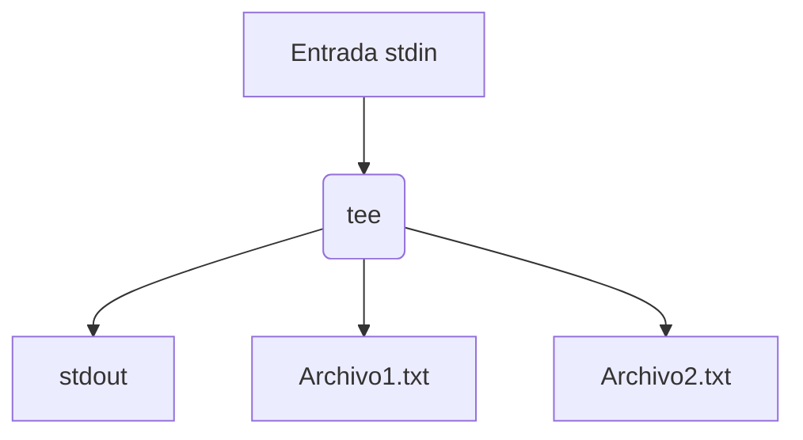

## **Comando `tee` en Linux**

### **Definición**

- **Propósito**: Lee datos de la entrada estándar (`stdin`) y los escribe tanto en la salida estándar (`stdout`) como en archivos.
- **Etimología**: Su nombre viene de la forma de una "T" en electrónica (divide un flujo en dos direcciones).

---

### **Opciones Principales**

| Opción | Descripción                                                                 |
|--------|-----------------------------------------------------------------------------|
| `-a`   | Agrega al final del archivo (en lugar de sobrescribirlo).                   |
| `-i`   | Ignora señales de interrupción (como `Ctrl+C`).                            |
| `--output-error` | Controla el comportamiento ante errores (ej: `warn` para mostrar advertencias). |

---

### **Casos de Uso con Ejemplos**

#### 1. **Guardar salida de un comando en un archivo y verla en pantalla**

```bash
ls -l | tee lista_archivos.txt  # Sobrescribe el archivo.
```

#### 2. **Agregar contenido a un archivo protegido (con `sudo`)**

```bash
echo "Línea nueva" | sudo tee -a /etc/config.conf
```

#### 3. **Depurar scripts y guardar logs**

```bash
./mi_script.sh 2>&1 | tee -a debug.log  # Captura stdout y stderr.
```

#### 4. **Escribir en múltiples archivos**

```bash
echo "Hola" | tee archivo1.txt archivo2.txt  # Mismo contenido en ambos.
```

#### 5. **Ignorar interrupciones (útil para procesos largos)**

```bash
ping google.com | tee -i ping.log  # No se detiene con Ctrl+C.
```

---

### **Comparación: `tee` vs `>` y `>>`**

| Comando                      | Acción                                      | Permisos con `sudo`            |
|------------------------------|--------------------------------------------|--------------------------------|
| `echo "texto" > archivo`     | Sobrescribe el archivo.                    | ❌ (solo el comando, no la redirección). |
| `echo "texto" >> archivo`    | Agrega al final del archivo.               | ❌ (mismo problema).           |
| `echo "texto" \| tee archivo` | Sobrescribe y muestra salida.              | ✅ (si se usa con `sudo`).     |
| `echo "texto" \| tee -a archivo` | Agrega y muestra salida.                | ✅ (si se usa con `sudo`).     |

---

### **Alternativas a `tee`**

#### 1. **Redirección estándar**

```bash
# Guardar salida en un archivo (sin verla en pantalla):
comando > archivo.txt
```

#### 2. **Usar `script` para capturar sesiones**

```bash
script -a sesion.log  # Guarda toda la sesión de la terminal.
```

#### 3. **Combinar con `grep` o filtros**

```bash
dmesg | grep "error" | tee -a errores.log  # Filtra y guarda.
```

---

### **Ejemplos Avanzados**

#### 1. **Capturar salida de un comando y filtrarla**

```bash
journalctl -u nginx | tee nginx.log | grep "404"
```

#### 2. **Usar con `tar` para respaldos**

```bash
tar -czvf - /ruta | tee backup.tar.gz | sha256sum > backup.sha256
```

#### 3. **Monitorear en tiempo real**

```bash
tail -f /var/log/syslog | tee monitor.log  # Muestra y guarda logs en vivo.
```

---

### **Notas Adicionales**

- **Advertencia**: `tee` sobrescribe archivos por defecto. Usa `-a` para evitar pérdida de datos.
- **Permisos**: Siempre que trabajes con archivos del sistema (`/etc/`, `/var/`), usa `sudo tee`.
- **Performance**: `tee` es eficiente, pero evita usarlo con flujos de datos masivos sin filtros.

---

## **Síntesis Visual **



---


