**Markdown** es un lenguaje de marcado ligero (texto plano) diseñado para dar formato a documentos de manera sencilla, utilizando símbolos y caracteres especiales (como `#`, `*`, `-`, `>`). Su objetivo es que el texto sea **fácil de leer y escribir** en su forma original, pero también pueda convertirse fácilmente a HTML u otros formatos visuales (como PDF o páginas web).
# Encabezados

Encabezados dejando un espacio del # . cuantos mas # el enccabezado es mas chico o menor importancia

# titulo1
## titulo 2
### titulo 3
#### titulo 4
##### titulo5
###### titulo 6

## Imagenes

#### Imagenes internas

- \!\[\[nombreDelArchivo.imagen\]\]
- \[\[nombreDelArchivo.imagen\]\]
- \!\[\[nombreDelArchivo.imagen\]\]

#### Imagenes externas

- \!\[nombreDeLaImagen]\(url\)
- 

## Link externos

Hay dos maneras de poner links externos
1 Escribir direcatmente el link
https://obsidian.md/
2 Escribir entre corches el nombre y entre parentecis la direccion
\[Excalidraw\]\(https:\/\/excalidraw.com/\)
[Excalidraw](https://excalidraw.com/)
otro tema

## Backlink = Retro ligas \(Links internos\)

estas se crean con doble cortchete **\[\[\]\]**
creando una coneccion [[Mermaid]]


## Backlink a otras guias y mas info: 

### [[GuiaMarkdown]]

## Snippets [[snippets]]

## Lista 

despues del -, *, 1. tiene que existir un espacio 

### Lista ordenada

1. Primavera
1. Verano
1. Otoño
1. Invierno

- Primavera
- Verano
- Otoño
- Invierno

* Primavera
* Verano
* Otoño
* Invierno

### Sublista


* Primavera
    - Septiembre
    - Octubre
    - Noviembre
* Verano
    - Diciembre
    - Enero
    - Febrero
* Otoño
    - Marzo
    - Abril
    - Mayo
* Invierno
    - Junio
    - Julio
        - Mi cumple
    - Agosto

## Lista \/ Tareas 

Sintaxis **\- \[ \]**  Entre cada caracter debe haber un espacio.

- [ ] tarea 1
- [x] tarea 2
- [ ] tarea 3
 
## Cita en una linea

Se ultiliza el caracter : **\>**

> Siempre tienes opcion de no tener opinio. - marco aurelio

## Cita en bloque

> todo lo que escuchamos es una opinion, no un hecho.
>
> todo lo que vemos es una perspectiva, no la verdad.
>
> Marco aurelio.

## Callouts

Sintaxis **\>\[\!palabra_clave\]**  Mensaje

Segun Palabras claves cambiara el color y el icono del callout.
Palabras claves:

**note**, **abstract**, **summary**, **tldr**, **info**, **todo**, **tip**, **hint**, **important**, **success**, **check**, **done**, **question**, **help**, **faq**, **warning**, **caution**, **attention**, **failure**, **fail**, **missing**, **danger**, **error**, **bug**, **example**,  **quote**, **cite**.

Palabras claves agrupadas por color:

- note (blue)
- abstract, summary, tldr (green)
- info (blue)
- todo (blue)
- tip, hint, important (sky blue)
- success, check, done (green)
- question, help, faq (yellow)
- warning, caution, attention (orange)
- failure, fail, missing (red)
- danger, error (red)
- bug (red)
- example (purple)
- quote, cite (grey)

>[!note] El arte de la guerra
>Es así como, en la guerra, el estratega victorioso solo busca la batalla después de que se haya asegurado la victoria, mientras que aquel destinado a la derrota, primero combate y después busca la victori

### collatus expandible

Sintaxis **\>\[\!note\]\-**

>[!note]- El arte de la guerra
>Es así como, en la guerra, el estratega victorioso solo busca la batalla después de que se haya asegurado la victoria, mientras que aquel destinado a la derrota, primero combate y después busca la victori

>[!attention]- El arte de la guerra
>Es así como, en la guerra, el estratega victorioso solo busca la batalla después de que se haya asegurado la victoria, mientras que aquel destinado a la derrota, primero combate y después busca la victori

## Tablas 

tiene que tener si o si debajo del encabezado de la tabla 3 guiones por cada columna dividida por el caracter: **|** 

| nombre | edad | corro               |     |     |
| ------ | ---- | ------------------- | --- | --- |
| jon    | 30   | jonmircha@gmail.com |     |     |
| oto    | 19   | otoreloco@gmail.com |     |     |
|        |      |                     |     |     |


## Codigo en una linea 
Se obtiene usando el caracter: acento grave **\`** ("CTRL+SHIFT+u" 60)
En una linea se ultiliza el acento grave de la siguiente manera. Uno al inicio y otro al final 
**\`let\`**
  `let`
  
## Codigo en bloque 

Se utiliza el acento grave, pero 3 al inicio, 3 al cierre, y colocando el nombre del lenguaje se colerea la sintaxis
El codigo html lo interpreta sin acentos graves y escribiendo html puro

```js
function sumar  (a, b) {
    return a + b;
}
```

\`\`\`python
print("hola mundillo")
\`\`\`

```python
print("hola mundillo")
```

## Comentario
\<\!\-\- esto es un comentario \-->
<!-- esto es un comentario -->

Para uitlizar \*\ _  \[\] etc se utiliza la contrabarra \\ para que los lea y los utilice como tal caracteres


## Notas al pie
Sintaxis 
\[\^1\] Se utiliza para marcar la palabra o frase.
\[\^2\]\: Se utiliza para la definicion o explicacion de lo marcado anteriormente

Obsidian[^1] nos permite tomar notas y ordenas las ideas con el metodo zzz[^2] por medio de Marckdown[^3],   

[^1]:es un programa
[^2]:es el creador de tomar notas y relacionarlas
[^3]:es un tipo de lenguaje de marcad
## Atajos de teclados

| Función                                         | Atajo                               |                |
| ----------------------------------------------- | ----------------------------------- | -------------- |
| Editor: guardar archivo                         |                                     | Ctrl / Cmd + S |
| Crear nueva nota                                | Ctrl / Cmd + N                      |                |
| Abrir paleta de comandos                        | Ctrl / Cmd + P                      |                |
| Abrir conmutador rápido                         | Ctrl / Cmd + O                      |                |
| Buscar en todos los archivos                    | Ctrl / Cmd + Shift+F                |                |
| Abrir vista de gráfico                          | Ctrl / Cmd + G                      |                |
| Destacar archivo actual                         | Blanco                              |                |
| Desmarcar archivo actual                        | Blanco                              |                |
| Grabadora de audio: comience a grabar           | Blanco                              |                |
| Grabadora de audio: detener la grabación Blanco |                                     |                |
| Convertidor de Markdown abierto                 | Blanco                              |                |
| Abre la nota de hoy                             | Blanco                              |                |
| Crear nueva nota Zettelkasten                   | Blanco                              |                |
| Abrir nota aleatoria                            | Blanco                              |                |
| Navegar hacia atrás                             | Ctrl / Cmd + Alt + Flecha izquierda |                |
| Navegar hacia adelante                          | Ctrl / Cmd + Alt + Flecha derecha   |                |
| Ubicación de la bóveda abierta                  | Blanco                              |                |
| Usa el modo oscuro                              | Blanco                              |                |
| Usar modo de luz                                | Blanco                              |                |
| Buscar archivo actual                           | Ctrl / Cmd + F                      |                |
| Alternar el modo de edición / vista previa      | Ctrl / Cmd + E                      |                |
| Eliminar archivo actual                         | Blanco                              |                |
| Dividir vertical                                | Blanco                              |                |
| Dividir horizontal                              | Blanco                              |                |
| Cerrar panel activo                             | Blanco                              |                |
| Cerrar todos los demás paneles                  | Blanco                              |                |
| Abrir configuración                             | Ctrl / Cmd + ,                      |                |

Edición 

| Función                         | Atajo             |
| ------------------------------- | ----------------- |
| Texto seleccionado en negrita   | Ctrl / Cmd + B    |
| Texto seleccionado en cursiva   | Ctrl / Cmd + I    |
| Insertar enlace externo         | Ctrl / Cmd + K    |
| Sangria                         | Ctrl / Cmd + ]    |
| Sin sangría                     | Ctrl / Cmd + [    |
| Saltar al backlink seleccionado | Alt / Opt + Enter |

``` graph TD;
[...] rectángulos,
    (...) esquinas redondeadas,
    [(...)] óvalos,
    ((...)) círculos,
    (((...))) dobles círculos,
    {...} rombos,
    {{…}} hexágonos,
    [/...\] trapecios,
    [\.../] trapecios invertidos.
    [\...\] paralelogramo,
    [/.../] otro paralelogramo.
```

```
graph TD;
    rectángulo[...] rectángulos
```


---

¡Perfecto! Para crear una estructura de directorios **visualmente similar al comando `tree`** directamente en una nota de Obsidian, puedes hacerlo manualmente usando **texto plano con formato**. Aquí te explico cómo:

---

### **Ejemplo Básico (Texto Plano)**

Puedes escribir la estructura usando guiones (`├──`, `└──`) y barras verticales (`│`) para simular la jerarquía.  
**Así se vería en tu nota:**

````markdown
```bash
Mi_Vault/
├── 📂 Inbox
├── 📂 Areas
│   ├── 📂 Personal
│   │   ├── Salud.md
│   │   └── Finanzas.md
│   └── 📂 Trabajo
│       └── Reuniones.md
├── 📂 Projects
│   ├── 📂 Proyecto_X
│   └── 📂 Proyecto_Y
└── 📂 Resources
    ├── 📂 Templates
    └── 📂 Attachments
```
````

**Resultado en Obsidian:**  


---

### **Formato Avanzado (Con Emojis y Colores)**
Si quieres hacerlo más visual, usa **emojis** y **negritas** para resaltar carpetas/archivos:  
```markdown
- 🗂️ **Mi_Vault**  
  - 📥 **Inbox** *(notas temporales)*  
  - 📚 **Areas**  
    - 👤 **Personal**  
      - 🩺 `Salud.md`  
      - 💰 `Finanzas.md`  
    - 💼 **Trabajo**  
      - 📅 `Reuniones.md`  
  - 🚀 **Projects**  
    - 🛠️ `Proyecto_X.md`  
    - 🧪 `Proyecto_Y.md`  
```

**Resultado en Obsidian:**  


---

### **Cómo Crearlo Paso a Paso**

1. **Jerarquía de Carpetas**: Usa guiones (`-` o `├──`) y espacios/tabulaciones para indentar.  
2. **Iconos**: Copia-pega emojis desde [emojipedia.org](https://emojipedia.org/) o usa símbolos como `📁`, `📂`, `📄`.  
3. **Archivos**: Nómbralos entre \`backticks\` (ej: \`Finanzas.md\`).  
4. **Comentarios**: Agrega notas entre paréntesis o *cursivas* (ej: `*(en progreso)*`).

---

### **Ejemplo con Archivos y Notas**

```bash
- 🗃️ **Mi_Vault**
  - 📂 Areas
    - 📂 Personal
      - 💡 `Ideas_Creativas.md`
      - 🏋️ `Rutina_Ejercicio.md`
    - 📂 Trabajo
      - 📊 `Informe_Q3.md`
      - 🔗 `Recursos_Utiles.md`
  - 📂 Projects
    - 🌱 `Proyecto_Jardineria` (Estado: 🟢 *Activo*)
    - 🎨 `Diseño_Web` (Estado: 🟠 *Pausado*)
  - 📂 Templates
    - ✉️ `Plantilla_Email.md`
    - 📝 `Meeting_Notes.md`
```

---

### **Consejos Profesionales**

- **Usa plugins**: Si quieres automatizar, prueba plugins como [Folder Note](https://obsidian.md/plugins?id=folder-note) para asociar notas a carpetas.  
- **Sistema PARAs**: Si sigues metodologías como **PARA** (Projects, Areas, Resources, Archives), estructura tus carpetas así.  
- **Enlaces**: Vincula carpetas/archivos con `[[Nombre_de_la_Nota]]` para navegación rápida.

---

```bash
Mi_Vault/
├── 📁 Inbox
│   ├── 📄 Nota_Diaria.md
│   └── 📄 Ideas_Bruta.md
├── 📁 Areas
│   ├── 📁 Personal
│   └── 📁 Trabajo
└── 📁 Templates
    └── 📄 Plantilla_Base.md
```


```bash
Mi_Vault/
├── Inbox
│   ├── nota_temp.md
│   └── ideas.md
├── Areas
│   ├── Personal
│   └── Trabajo
└── Templates
    └── plantilla.md
```


```
Mi_Vault/
├── Inbox
│   ├── nota_temp.md
│   └── ideas.md
├── Areas
│   ├── Personal
│   └── Trabajo
└── Templates
    └── plantilla.md
```

---

## Mermaid

### Nota: [[Mermaid]]

Mermaid es una herramienta de código abierto que permite crear diagramas y gráficos técnicos a partir de texto simple, utilizando un lenguaje de marcado similar a Markdown. Con Mermaid, puedes definir visualizaciones como:

1. **Diagramas de flujo**: Para procesos o algoritmos.  
   Ejemplo:
   ```mermaid
   graph TD
     A[Inicio] --> B{Decisión}
     B -->|Sí| C[Acción A]
     B -->|No| D[Acción B]
   ```

2. **Diagramas de secuencia**: Interacciones entre componentes.  
3. **Gantt**: Cronogramas de proyectos.  
4. **Clases**: Estructuras de programación orientada a objetos.  
5. **Gráficos de torta**: Porcentajes o proporciones.  

### Ventajas:
- **Texto a visual**: Escribe código y genera imágenes automáticamente.  
- **Integración**: Funciona con herramientas como GitHub, GitLab, VS Code, y plataformas de documentación (ej: MkDocs).  
- **Control de versiones**: Al ser texto, es fácil comparar cambios con Git.  

### Ejemplo rápido (diagrama de flujo):

```mermaid
graph LR
  A[Usuario] -->|Hace clic| B(Página de inicio)
  B --> C{Menú}
  C --> D[Contacto]
  C --> E[Productos]
```


Es ideal para documentación técnica, ya que simplifica la creación y actualización de diagramas sin depender de software externo. 🔄📊