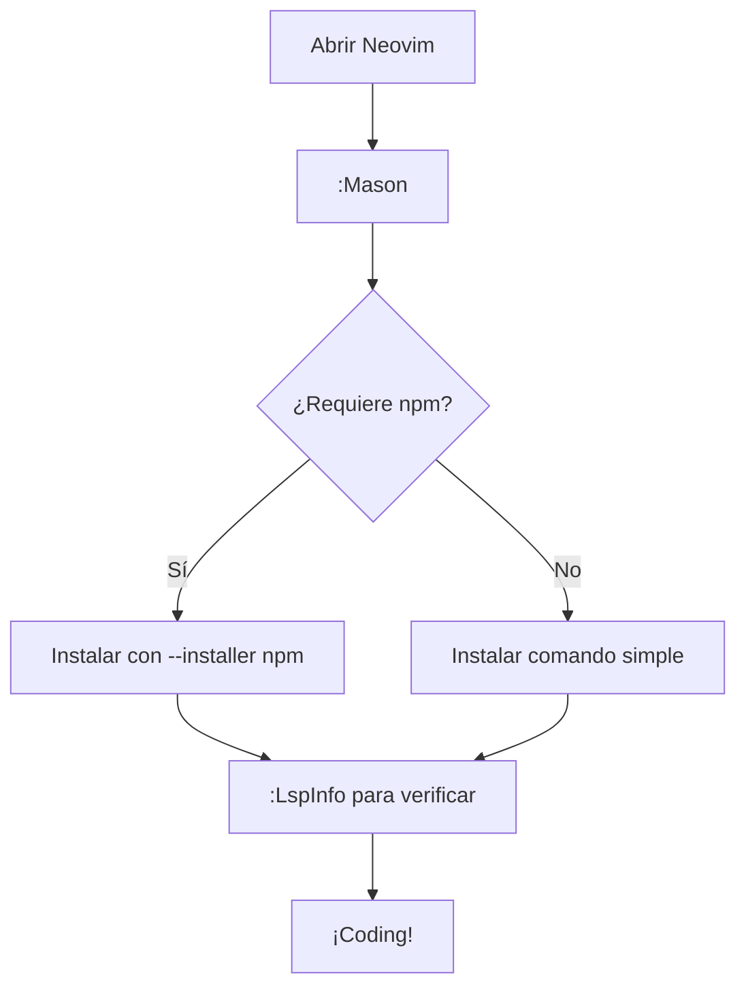

##  Instalacion y Configuracion de VIM

```bash
$apt install vim 
```

```bash
$mkdir .vim
```

```bash
vim vimrc #crear el archivo de configuracion 
```

ir al repo : https://github.com/junegunn/vim-plug
en el archivo **vimrc** poner las siguientes lineas :

```vim

set number
set mouse=a
syntax enable
set showcmd
set encoding=utf-8
set showmatch
set relativenumber
set showcmd
set ruler
set cursorline
set clipboard=unnamed
set numberwidth=1
set ignorecase
set incsearch
set scrolloff=8
set wildmenu
set history=100
set nocompatible
set hlsearch
set clipboard=unnamedplus


call plug#begin()

"tema
Plug 'sainnhe/gruvbox-material'
Plug 'shinchu/lightlines-gruvbox.vim'
"tipeo
Plug 'jiangmiao/auto-pairs'
Plug 'alvan/vim-closetag'

"syntax
Plug 'sheerun/vim-polyglot'
"stutus bar
Plug 'maximbaz/lightline-ale'
Plug 'itchyny/lightline.vim'

"fuentes nerfonts
Plug 'ryanoasis/vim-devicons'


call plug#end()

"configuracion de gruvbox
set background=dark
"let g:gruvbox_amterial_bacrground='medium'
let g:gruvbox_amterial_bacrground='dark'
colorscheme gruvbox-material
"barra 
set laststatus=2
set noshowmode

let &t_ut=''

"configuracion de grvbox hacerla despues de instalar el plugin con el comando :Plugiinstall
set background=dark
let g:gruvbox_amterial_bacrground='medium'
colorscheme gruvbox-material
set laststatus=2
set noshowmode
```

eliminar plug:
eliminar del vimrc el plug
:source %
:Plug Clean

# NEOVIM


 Link de la instalacion  
  https://github.com/neovim/neovim/wiki/Building-Neovim
  
```bash
$git clone https://github.com/neovim/neovim
```

```bash
$cd neovim && make CMAKE_BUILD_TYPE=RelWithDebInfo
```

```bash
$git checkout stable
```

```bash
$sudo make install
```


configuracion  e intalar plugin

https://github.com/junegunn/vim-plug 

desacargar el repo 

```
sh -c 'curl -fLo "${XDG_DATA_HOME:-$HOME/.local/share}"/nvim/site/autoload/plug.vim --create-dirs \
       https://raw.githubusercontent.com/junegunn/vim-plug/master/plug.vim'
```
crear la carpeta nvim en ~/.config

```
mkdir ~/.config/nvim
```

crear el archivo init.vim
```
touch init.vim
```

copiar el directorio autoload que se desacargo en /home/oto/.local/share/nvim/site/  en el directorio ~/.config/nvim

configuracion e instalacion de plugins
https://www.youtube.com/watch?v=2dG_Nl_r6s0&t=271s&ab_channel=ManuelNinahuanca

---


### Atajos y configuracion de VIM

Descargar de la pag. https://github.com/junegunn/vim-plug
 Si el directorio .confi/nvim no está crearlo. Download plug.vim el archivo plug.vim en la carpeta nvim
creamos el directorio autoload y pegamos el archivo plug.vim
en el archivo init.vim escribir las siguientes líneas:
(si no está el archivo init.vim crearlo en ./conf/nvim)

```
set number
set mouse=a
syntax enable
set showcmd
set encoding=utf-8
set relativenumber 
set sw=2
set smartindent
set nowrap
set incsearch
set ignorecase
set showmatch
set autoindent
set laststatus=2
set bg=dark
set clipboard=unnamedplus

call plug#begin(‘~/.vim/plugged’)

Plug 'sainnhe/gruvbox-material'

call plug#end()

"configuraciòn de gruvbox
Plug 'vim-airline/vim-airline'
set background=dark
let g:gruvbox_material_background='medium'
colorscheme gruvbox-material
```
tener instalado los comandos: curl  git

#### BÁSICOS

:e nombrearchivo - Abre un archivo para su edición
:w – Guardar archivos
:q – Salir de Vim
:q! - Salir de Vim sin guardar
:x – Escribir en archivo (si se han hecho cambios) y salir
:sav  nombrearchivo – Guarda archivo como nombrearchivo
. - Repite el último cambio realizado en modo normal
5. - Repite 5 veces el último cambio realizado en modo normal

##### MOVIÉNDOSE POR EL ARCHIVO

k o Tecla arriba – Mueve el cursor arriba una línea
j o Tecla abajo – Mueve el cursor abajo una línea
e – Mueve el cursor al final de la palabra
b – Mueve el cursor al principio de la palabra
0 – Mueve el cursor al principio de la línea
G – Mueve el cursor al final de la línea
gg – Mueve el cursor al principio del fichero
L – Mueve el cursor al final de la pantalla
:59 – Mueve el cursor a la línea 59. Reemplaza el número 59, por la línea que desees
20| - Mueve el cursor a la columna 20
% - Mueve el cursor hasta el paréntesis que aparezca

#### CORTAR, COPIAR Y PEGAR

y – Copiar el texto seleccionado al portapapeles
p – Pegar el contenido del portapapeles
dd – Cortar la línea actual
yw – Copiar palabra
yy – Copiar la línea actual
y$ - Copiar al final de la línea
D – Cortar al final de la línea

##### BÚSQUEDA

/palabra – Buscar palabra desde el inicio hasta el final
?palabra – Buscar palabra desde el final hasta el principio
* - Buscar palabra a continuación del cursor
/cpalabra – Busca palabra sin distinguir entre mayúsculas y minúsculas
/jo[ha]n – Busca john o joan
/< por - Busca por, portátil o porra
/por> - Busca por o vapor
/< por> - Busca por
/< ¦.> - Busca todas las palabras de cuatro letras
// - Busca fred pero no alfred o frederick
/fred|joe – Busca fred o joe
/ - Busca exáctamente 4 dígitos
/^n{3} – Busca 3 líneas vacías
:bufdo /palabra/ - Busca en todos los archivos abiertos
bufdo %s/algo/algomas/g – Busca algo en todos los ficheros abiertos y lo reemplaza por algo más

#### REEMPLAZAR

:%s/viejo/nuevo/g – Reemplaza todas las ocurrencias de viejo por nuevo en el fichero
:%s/viejo/nuevo/gi – Reemplaza todas las ocurrencias de viejo por nuevo en el fichero distinguiendo entre mayúsculas y minúsculas
:%s/viejo/nuevo/gc – Reemplaza todas las ocurrencias con confirmación
:2,35s/viejo/nuevo/g - Reemplaza todas las ocurrencias entre la línea 2 y 35
:5,$s/old/new/g – Reemplaza todas las ocurrencias desde la línea 5 hasta el final
:%s/^/hola/g – Reemplaza cada principio de línea por un hola
:%s/$/Jorge/g – Reemplaza cada final de línea por un Jorge
:%s/ *$//g – Borra todos los espacios en blanco
:g/palabra/d – Elimina todas las líneas que contienen palabra
:v/palabra/d – Elimina todas las líneas que no contienen palabra
:s/Bill/Steve/ - Reemplaza la primera ocurrencia de Bill por Steve en la línea actual
:s/Bill/Steve/g - Reemplaza Bill por Steve en la línea actual
:%s/Bill/Steve/g - Reemplaza Bill por Steve en todo el fichero
:%s/^M//g – Elimina los retornos de carro
:%s/r/r/g – Elimina los retornos de carro en los returns
:%s#<[^>]+>##g – Elimina los tags de HTML pero conserva el texto
:%s/^(.*)n1$/1/ - Elimina líneas duplicadas
Ctrl+a – Incrementa el número bajo el cursor
Ctrl+x – Decrementa el número bajo el cursor
ggVGg? - Cambia el texto a Rot13

#### TRANSFORMACIÓN

Vu - Minúsculas
VU - Mayúsculas
g~~ - Invertir
vEU – Cambiar palabra a mayúsculas
vE~ - Modificar el tipo de la palabra
ggguG – Transformar todos los textos a minúsculas
gggUG Set – Transformar todos los textos a mayúsculas
:set ignorecase – Ignorar el tipo en las búsquedas
:set smartcase – Ignorar el tipo en las búsquedas excepto si se usa una letra mayúscula
:%s/<./u&/g – Define la primera letra de cada palabra a mayúsculas
:%s/<./l&/g – Define la primera letra de cada palabra a minúsculas
:%s/.*/u& – Define la primera letra de cada línea a mayúsculas
:%s/.*/l& – Define la primera letra de cada línea a minúsculas

#### LEER/ESCRIBIR ARCHIVOS

:1,10 w otrofichero - Guarda desde la línea 1 a la 10 en otro fichero
:1,10 w >> otrofichero – Adjunta desde la línea 1 a la 10 en otro fichero
:r otrofichero – Inserta el contenido de otro fichero
:23r infile – Inserta el contenido de otro fichero desde la línea 23

#### EXPLORADOR DE ARCHIVOS

:e . - Abre el explorador de archivos integrado
:Sex – Divide la ventana y abre el explorador de archivos integrado
:Sex! - Lo mismo que :Sex pero dividiendo la ventana verticalmente
:browse e – Explorador de archivos gráfico
:ls – Listar buffers
:cd .. - Moverse al directorio padre
:args – Listar ficheros
:args *.php – Lista ficheros con la extensión php
:grep expresion *.php – Lista ficheros con la extensión php que contienen expresión

#### ALINEACIÓN

:%!fmt - Alinear todas las líneas
!}fmt – Alinear todas las líneas en la posición actual
5!!fmt – Alinear las próximas 5 líneas
TABS/VENTANAS
:tabnew – Crea un nuevo tab
gt – Muestra el siguiente tab
:tabfirst – Muestra el primer tab
:tablast - Muestra el último tab
:tabm n(posicion) – Ir al tab posicion
:tabdo %s/foo/bar/g – Ejecuta un comando en todos los tabs
:tab ball – Pone todos los archivos abiertos en tabs
:new abc.txt – Edita el archivo abc.txt en una nueva ventana

#### AUTO-COMPLETADOR

Ctrl+n Ctrl+p (en modo inserción) – Completar palabra
Ctrl+x Ctrl+l – Completar línea
:set dictionary=dict – Define dict como un diccionario
Ctrl+x Ctrl+k - Completar con diccionario

#### ABREVIATURAS

:ab mail [email protected] – Define mail como abreviatura de [email protected]

#### INDENTACIÓN DE TEXTO

:set autoindent - Configurar auto indentación
:set smartindent – Configurar autoindentación inteligente
:set shiftwidth=4 – Definir 4 espacios como tamaño de indentación
ctrl-t, ctrl-d – Indentar o desindentar en modo inserción
>> - Indentar
<< - Desindentar
=% - Indentar el código entre paréntesis
1GVG= - Indentar todo el fichero


---

---

---


## NeoVim


Neovim appimage

para ejecutar el appimage de nvim creamos el alias


```bash
alias nv='/media/user/bodzzy/appimage/nvim-linux-x86_64.appimage'
```

---

```
syntax enable

set guicursor=                                     " Disable blinking for the n-v-c modes
set termguicolors
set guioptions-=T                                   " No Tool bar

set cursorline                                     " Highlight the current line

set hidden                                         " When on a buffer becomes hidden when it is abandoned
set path+=**
set nowrap
set encoding=UTF-8

set number relativenumber

set smartindent
set smarttab
set tabstop=4 softtabstop=4
set shiftwidth=4
set expandtab
set smartcase
set incsearch
set nohlsearch
set completeopt=menuone,noinsert,noselect
set signcolumn=yes
set colorcolumn=80
highlight ColorColumn ctermbg=0 guibg=lightgrey

set noswapfile
set nobackup
set undofile
execute 'set undodir=' . g:nvim_data_root . '/undodir'


```


## Ecript para configurar nvim

crear el directorio vim

```bash
mkdir -p ~/.config/nvim
```

crear archvio init.vim 

```bash
touch ~/.config/nvim/init.vim
```

Administrador de pluggins

```bash
# En setup.sh
curl -fLo ~/.config/nvim/autoload/plug.vim --create-dirs \https://raw.githubusercontent.com/junegunn/vim-plug/master/plug.vim
```

### **Script configuracion nvim**

```bash
#!/bin/bash

# Crear el directorio de configuración de Neovim
mkdir -p ~/.config/nvim

# Crear el archivo init.vim con la configuración personalizada
cat <<EOL > ~/.config/nvim/init.vim
" Configuración básica
syntax enable
set number
set tabstop=4
set shiftwidth=4
set expandtab

" Configuración de vim-plug
call plug#begin('~/.config/nvim/plugged')

" Plugins para Python
Plug 'nvim-treesitter/nvim-treesitter', {'do': ':TSUpdate'}
Plug 'neoclide/coc.nvim', {'branch': 'release'}
Plug 'vim-python/python-syntax'
Plug 'davidhalter/jedi-vim'
Plug 'jmcantrell/vim-virtualenv'
Plug 'dense-analysis/ale'
Plug 'psf/black', { 'branch': 'stable' }
Plug 'heavenshell/vim-pydocstring', { 'do': 'make install' }

" Plugins generales
Plug 'preservim/nerdtree'
Plug 'tpope/vim-fugitive'

call plug#end()

" Configuración adicional
let g:python_highlight_all = 1
let g:coc_global_extensions = ['coc-pyright']
let g:ale_linters = {'python': ['flake8', 'pylint']}
let g:ale_fixers = {'python': ['black', 'isort']}
autocmd BufWritePre *.py execute ':Black'
EOL

echo "¡Configuración de Neovim completada!"
```


Dentro de Neovim, ejecuta el siguiente comando para verificar la ruta del archivo de configuración cargado:

```bash
:echo stdpath('config')
```


Verifica si existe alguna configuración en estas rutas:

```bash
cat /etc/xdg/nvim/sysinit.vim
cat /usr/share/nvim/sysinit.vim
```

Deshabilitar configuraciones globales:

```bash
set runtimepath-=/usr/share/nvim
```

Deshabilitar los signos $ y +

```bash
" Deshabilitar caracteres especiales al final de las líneas
set nolist          " Desactiva la visualización de caracteres especiales
set showbreak=      " Elimina el indicador de salto de línea
```

Instala vim-plug automáticamente en tu script:

```bash
# En setup.sh
curl -fLo ~/.config/nvim/autoload/plug.vim --create-dirs \
    https://raw.githubusercontent.com/junegunn/vim-plug/master/plug.vim
```
---

## Plugins enfocados en Python


### **Plugins recomendados para Python**

#### **1. **`nvim-treesitter`**
   - **Descripción**: Proporciona un resaltado de sintaxis mejorado y más preciso usando el sistema de "tree-sitter".
   
   - **Instalación**:
   
```vim
Plug 'nvim-treesitter/nvim-treesitter', {'do': ':TSUpdate'}
```
   - **Configuración básica**:
   
```vim
lua <<EOF
require'nvim-treesitter.configs'.setup {
  ensure_installed = "all",  " Instala soporte para todos los lenguajes
  highlight = {
    enable = true,           " Habilita resaltado de sintaxis
  },
}
EOF
```

#### **2. **`coc.nvim`**

   - **Descripción**: Un poderoso motor de autocompletado (LSP - Language Server Protocol) que soporta múltiples lenguajes, incluyendo Python.
   
   - **Instalación**:
   
```vim
Plug 'neoclide/coc.nvim', {'branch': 'release'}
```
   - **Configuración básica**:
   
```vim
" Configuración de coc.nvim
let g:coc_global_extensions = ['coc-pyright']  " Usa Pyright para Python
```

#### **3. **`python-syntax`**

   - **Descripción**: Mejora el resaltado de sintaxis para Python.
   
   - **Instalación**:
   
```vim
Plug 'vim-python/python-syntax'
```
   - **Configuración básica**:
   
```vim
let g:python_highlight_all = 1  " Habilita todas las opciones de resaltado
```

#### **4. **`jedi-vim`**

   - **Descripción**: Integra el autocompletado y análisis de código de Jedi (una herramienta popular para Python).
   
   - **Instalación**:
   
```vim
Plug 'davidhalter/jedi-vim'
```
   - **Configuración básica**:
   
```vim
let g:jedi#completions_enabled = 1  " Habilita autocompletado
let g:jedi#use_tabs_not_buffers = 1 " Usa pestañas en lugar de buffers
```

#### **5. **`vim-virtualenv`**

   - **Descripción**: Maneja automáticamente entornos virtuales de Python.
   
   - **Instalación**:
   
```vim
Plug 'jmcantrell/vim-virtualenv'
```
   - **Configuración básica**:
   
```vim
let g:virtualenv_auto_activate = 1  " Activa automáticamente el entorno virtual
```

#### **6. **`ale` (Asynchronous Lint Engine)**

   - **Descripción**: Proporciona linting (análisis de código) en tiempo real para Python y otros lenguajes.
   
   - **Instalación**:
   
```vim
Plug 'dense-analysis/ale'
```
   - **Configuración básica**:
   
```vim
let g:ale_linters = {'python': ['flake8', 'pylint']}  " Usa flake8 y pylint
let g:ale_fixers = {'python': ['black', 'isort']}    " Usa black e isort para formatear
```

#### **7. **`black` (formateador de código)**

   - **Descripción**: Integra el formateador de código `black` para Python.
   
   - **Instalación**:
   
```vim
Plug 'psf/black', { 'branch': 'stable' }
```
   - **Configuración básica**:
   
```vim
autocmd BufWritePre *.py execute ':Black'  " Formatea automáticamente al guardar
```

#### **8. **`vim-pydocstring`**

   - **Descripción**: Genera automáticamente docstrings para funciones y clases de Python.
   
   - **Instalación**:
   
```vim
Plug 'heavenshell/vim-pydocstring', { 'do': 'make install' }
```
   - **Configuración básica**:
   
```vim
let g:pydocstring_enable_mapping = 1  " Habilita atajos de teclado
```

#### **9. **`nerdtree`**

   - **Descripción**: Un explorador de archivos para Neovim.
   
   - **Instalación**:
   
```vim
Plug 'preservim/nerdtree'
```
   - **Configuración básica**:
   
```vim
map <C-n> :NERDTreeToggle<CR>  " Atajo para abrir/cerrar NERDTree
```

#### **10. **`vim-fugitive`**

   - **Descripción**: Integración con Git directamente en Neovim.
   
   - **Instalación**:
```vim
Plug 'tpope/vim-fugitive'
```

---

### **Script de configuración con plugins**
Aquí tienes un ejemplo de cómo configurar Neovim con estos plugins usando `vim-plug`:

```bash
#!/bin/bash

# Crear el directorio de configuración de Neovim
mkdir -p ~/.config/nvim

# Crear el archivo init.vim con la configuración personalizada
cat <<EOL > ~/.config/nvim/init.vim
" Configuración básica
syntax enable
set number
set tabstop=4
set shiftwidth=4
set expandtab

" Configuración de vim-plug
call plug#begin('~/.config/nvim/plugged')

" Plugins para Python
Plug 'nvim-treesitter/nvim-treesitter', {'do': ':TSUpdate'}
Plug 'neoclide/coc.nvim', {'branch': 'release'}
Plug 'vim-python/python-syntax'
Plug 'davidhalter/jedi-vim'
Plug 'jmcantrell/vim-virtualenv'
Plug 'dense-analysis/ale'
Plug 'psf/black', { 'branch': 'stable' }
Plug 'heavenshell/vim-pydocstring', { 'do': 'make install' }

" Plugins generales
Plug 'preservim/nerdtree'
Plug 'tpope/vim-fugitive'

call plug#end()

" Configuración adicional
let g:python_highlight_all = 1
let g:coc_global_extensions = ['coc-pyright']
let g:ale_linters = {'python': ['flake8', 'pylint']}
let g:ale_fixers = {'python': ['black', 'isort']}
autocmd BufWritePre *.py execute ':Black'
EOL

echo "¡Configuración de Neovim completada!"
```

---

### **Cómo instalar los plugins**

1. Guarda el script en un archivo, por ejemplo `setup_nvim.sh`.

2. Haz que el script sea ejecutable:

```bash
chmod +x setup_nvim.sh
```
3. Ejecuta el script:

```bash
./setup_nvim.sh
```
4. Abre Neovim e instala los plugins:

```bash
nvim
:PlugInstall
```

---


## Plugins y configuraciones para python

### **1. Script para configurar Neovim con plugins básicos**

Este script configura Neovim con plugins útiles para Python y desarrollo en general.

#### **Archivo: `setup_nvim.sh`**

```bash
#!/bin/bash

# Crear el directorio de configuración de Neovim
mkdir -p ~/.config/nvim

# Crear el archivo init.vim con la configuración personalizada
cat <<EOL > ~/.config/nvim/init.vim
" Configuración básica
syntax enable
set number
set tabstop=4
set shiftwidth=4
set expandtab

" Configuración de vim-plug
call plug#begin('~/.config/nvim/plugged')

" Plugins para Python
Plug 'nvim-treesitter/nvim-treesitter', {'do': ':TSUpdate'}
Plug 'neoclide/coc.nvim', {'branch': 'release'}
Plug 'vim-python/python-syntax'
Plug 'davidhalter/jedi-vim'
Plug 'jmcantrell/vim-virtualenv'
Plug 'dense-analysis/ale'
Plug 'psf/black', { 'branch': 'stable' }
Plug 'heavenshell/vim-pydocstring', { 'do': 'make install' }

" Plugins generales
Plug 'preservim/nerdtree'
Plug 'tpope/vim-fugitive'

call plug#end()

" Configuración adicional
let g:python_highlight_all = 1
let g:coc_global_extensions = ['coc-pyright']
let g:ale_linters = {'python': ['flake8', 'pylint']}
let g:ale_fixers = {'python': ['black', 'isort']}
autocmd BufWritePre *.py execute ':Black'
EOL

echo "¡Configuración de Neovim completada!"
```

#### **Cómo usarlo:**

1. Guarda el script en un archivo, por ejemplo `setup_nvim.sh`.
2. Haz que el script sea ejecutable:

```bash
chmod +x setup_nvim.sh
```

3. Ejecuta el script:

```bash
./setup_nvim.sh
```

4. Abre Neovim e instala los plugins:

```bash
nvim
:PlugInstall
```

---

### **2. Script para configurar el autocompletado con `coc.nvim`**

Este script configura `coc.nvim` para autocompletado en Python.

#### **Archivo: `setup_coc.sh`**

```bash
#!/bin/bash

# Crear el directorio de configuración de Neovim
mkdir -p ~/.config/nvim

# Crear el archivo init.vim con la configuración de coc.nvim
cat <<EOL > ~/.config/nvim/init.vim
" Configuración básica
syntax enable
set number
set tabstop=4
set shiftwidth=4
set expandtab

" Configuración de vim-plug
call plug#begin('~/.config/nvim/plugged')

Plug 'neoclide/coc.nvim', {'branch': 'release'}

call plug#end()

" Configuración de coc.nvim
let g:coc_global_extensions = ['coc-pyright']

" Atajos de teclado para autocompletado
inoremap <silent><expr> <TAB>
      \ coc#pum#visible() ? coc#pum#next(1) :
      \ CheckBackspace() ? "\<Tab>" :
      \ coc#refresh()
inoremap <expr><S-TAB> coc#pum#visible() ? coc#pum#prev(1) : "\<C-h>"

" Confirmar autocompletado con Enter
inoremap <silent><expr> <CR> coc#pum#visible() ? coc#pum#confirm() : "\<C-g>u\<CR>"
EOL

echo "¡Configuración de coc.nvim completada!"
```

#### **Cómo usarlo:**

1. Guarda el script en un archivo, por ejemplo `setup_coc.sh`.

2. Haz que el script sea ejecutable:

```bash
chmod +x setup_coc.sh
```
3. Ejecuta el script:

```bash
./setup_coc.sh
```

4. Abre Neovim e instala `coc.nvim`:

```bash
nvim
:PlugInstall
```
   
5. Instala el servidor LSP para Python:

```vim
:CocInstall coc-pyright
```

---

### **3. Script para configurar `nerdtree`**

Este script configura `nerdtree`, un explorador de archivos para Neovim.

#### **Archivo: `setup_nerdtree.sh`**

```bash
#!/bin/bash

# Crear el directorio de configuración de Neovim
mkdir -p ~/.config/nvim

# Crear el archivo init.vim con la configuración de nerdtree
cat <<EOL > ~/.config/nvim/init.vim
" Configuración básica
syntax enable
set number

" Configuración de vim-plug
call plug#begin('~/.config/nvim/plugged')

Plug 'preservim/nerdtree'

call plug#end()

" Atajo para abrir/cerrar NERDTree
map <C-n> :NERDTreeToggle<CR>
EOL

echo "¡Configuración de nerdtree completada!"
```

#### **Cómo usarlo:**

1. Guarda el script en un archivo, por ejemplo `setup_nerdtree.sh`.

2. Haz que el script sea ejecutable:

```bash
chmod +x setup_nerdtree.sh
```
   
3. Ejecuta el script:

```bash
./setup_nerdtree.sh
```
4. Abre Neovim e instala `nerdtree`:

```bash
nvim
:PlugInstall
```

---

### **4. Script para configurar `black` (formateador de código)**

Este script configura `black`, un formateador de código para Python.

#### **Archivo: `setup_black.sh`**

```bash
#!/bin/bash

# Crear el directorio de configuración de Neovim
mkdir -p ~/.config/nvim

# Crear el archivo init.vim con la configuración de black
cat <<EOL > ~/.config/nvim/init.vim
" Configuración básica
syntax enable
set number

" Configuración de vim-plug
call plug#begin('~/.config/nvim/plugged')

Plug 'psf/black', { 'branch': 'stable' }

call plug#end()

" Formatear automáticamente al guardar
autocmd BufWritePre *.py execute ':Black'
EOL

echo "¡Configuración de black completada!"
```

#### **Cómo usarlo:**

1. Guarda el script en un archivo, por ejemplo `setup_black.sh`.

2. Haz que el script sea ejecutable:

```bash
chmod +x setup_black.sh
```
   
3. Ejecuta el script:

```bash
./setup_black.sh
```

4. Abre Neovim e instala `black`:

```bash
nvim
:PlugInstall
```

---

### **Consejos generales**

1. **Verifica dependencias**:

   - Asegúrate de tener instalado `git` y `curl` en tu sistema.
   - Para `black`, necesitas tener Python instalado.

2. **Reinicia Neovim**:

   - Después de instalar los plugins, reinicia Neovim para que los cambios surtan efecto.

3. **Verifica errores**:

   - Si algo no funciona, usa `:messages` en Neovim para ver los errores.

---


### Configuracion con lua


Instalacion de packer.ivim

```
-- Archivo: ~/.config/nvim/init.lua

-- Instalar Packer.nvim si no está instalado
local fn = vim.fn
local install_path = fn.stdpath('data') .. '/site/pack/packer/start/packer.nvim'

if fn.empty(fn.glob(install_path)) > 0 then
  fn.system({ 'git', 'clone', '--depth', '1', 'https://github.com/wbthomason/packer.nvim', install_path })
  vim.cmd [[packadd packer.nvim]]
end

-- Cargar Packer.nvim
require('packer').startup(function(use)
  -- Packer puede gestionarse a sí mismo
  use 'wbthomason/packer.nvim'

  -- Aquí añadiremos los plugins más adelante
end)

```

Configuracion init.lua

```
-- Archivo: ~/.config/nvim/init.lua

-- 1. Cargar packer.nvim (gestor de plugins)
require('packer').startup(function(use)
  -- Packer puede gestionarse a sí mismo
  use 'wbthomason/packer.nvim'

  -- Tema de colores (opcional)
  use 'folke/tokyonight.nvim'

  -- LSP config
  use 'neovim/nvim-lspconfig'
  use 'williamboman/mason.nvim'
  use 'williamboman/mason-lspconfig.nvim'

  -- Autocompletado
  use 'hrsh7th/nvim-cmp'
  use 'hrsh7th/cmp-nvim-lsp'
  use 'L3MON4D3/LuaSnip'

  -- File explorer (nvim-tree.lua)
  use 'nvim-tree/nvim-tree.lua'

  -- Búsqueda (telescope.nvim)
  use 'nvim-telescope/telescope.nvim'
  use 'nvim-lua/plenary.nvim'  -- Dependencia de telescope

  -- Barra de estado (lualine.nvim)
  use 'nvim-lualine/lualine.nvim'
end)

-- 2. Configuración básica de Neovim
vim.opt.number = true          -- Mostrar números de línea
vim.opt.relativenumber = true  -- Números de línea relativos
vim.opt.tabstop = 4            -- Tamaño de tabulación
vim.opt.shiftwidth = 4         -- Tamaño de indentación
vim.opt.expandtab = true       -- Usar espacios en lugar de tabs

-- 3. Configuración de LSP
require('mason').setup()
require('mason-lspconfig').setup({
  ensure_installed = { 'pyright', 'bashls', 'tsserver' }  -- Servidores para Python, Bash, JS/TS
})

local lspconfig = require('lspconfig')
lspconfig.pyright.setup({})  -- LSP para Python
lspconfig.bashls.setup({})   -- LSP para Bash
lspconfig.tsserver.setup({}) -- LSP para JavaScript/TypeScript

-- 4. Configuración de autocompletado (nvim-cmp)
local cmp = require('cmp')
cmp.setup({
  snippet = {
    expand = function(args)
      require('luasnip').lsp_expand(args.body)
    end,
  },
  mapping = cmp.mapping.preset.insert({
    ['<C-b>'] = cmp.mapping.scroll_docs(-4),
    ['<C-f>'] = cmp.mapping.scroll_docs(4),
    ['<C-Space>'] = cmp.mapping.complete(),
    ['<C-e>'] = cmp.mapping.abort(),
    ['<CR>'] = cmp.mapping.confirm({ select = true }),
  }),
  sources = cmp.config.sources({
    { name = 'nvim_lsp' },
    { name = 'luasnip' },
  })
})

-- 5. Configuración de nvim-tree.lua (File explorer)
require('nvim-tree').setup({
  view = {
    width = 30,  -- Ancho del explorador
  },
  actions = {
    open_file = {
      quit_on_open = true,  -- Cerrar el explorador al abrir un archivo
    },
  },
})

-- Atajo para abrir/cerrar el explorador de archivos
vim.api.nvim_set_keymap('n', '<C-n>', ':NvimTreeToggle<CR>', { noremap = true, silent = true })

-- 6. Configuración de telescope.nvim (Búsqueda)
require('telescope').setup({
  defaults = {
    mappings = {
      i = {
        ['<C-j>'] = 'move_selection_next',  -- Moverse hacia abajo en los resultados
        ['<C-k>'] = 'move_selection_previous',  -- Moverse hacia arriba en los resultados
      },
    },
  },
})

-- Atajos para buscar archivos y texto
vim.api.nvim_set_keymap('n', '<leader>ff', ':Telescope find_files<CR>', { noremap = true, silent = true })
vim.api.nvim_set_keymap('n', '<leader>fg', ':Telescope live_grep<CR>', { noremap = true, silent = true })

-- 7. Configuración de lualine.nvim (Barra de estado)
require('lualine').setup({
  options = {
    theme = 'tokyonight',  -- Usar el tema tokyonight
  },
})

```


Qué hacer después de crear el archivo?

1. Guardar el archivo:

Guarda el archivo como ~/.config/nvim/init.lua. Si la carpeta ~/.config/nvim no existe, créala.

2. Instalar los plugins:

Abre Neovim (nvim).

Ejecuta el siguiente comando para instalar los plugins:
vim
Copy

```vim
:PackerSync
```

Esto descargará e instalará todos los plugins que configuraste en init.lua.

3. Configurar atajos de teclado:

En el archivo init.lua ya configuré algunos atajos útiles:

 <C-n>: Abre/cierra el explorador de archivos (nvim-tree).

 <leader>ff: Busca archivos con telescope.

 <leader>fg: Busca texto en archivos con telescope.

 Puedes personalizar estos atajos según tus preferencias.

4. Probar la configuración:

Cierra y vuelve a abrir Neovim.

 Prueba los siguientes comandos:

<C-n>: Debería abrir el explorador de archivos a la izquierda.

<leader>ff: Debería abrir un buscador de archivos.

<leader>fg: Debería abrir un buscador de texto en archivos.

Verifica que el autocompletado funcione al escribir código en Python, Bash, etc.

5. Personalizar:

Si quieres cambiar el tema de colores, puedes modificar la línea theme = 'tokyonight' en la configuración de lualine y usar otro tema como gruvbox o onedark.

Si quieres añadir más plugins, agrégalos en la sección de require('packer').startup.

---

Estructura de tu configuración

Después de seguir estos pasos, tu configuración de Neovim debería tener:

1. Explorador de archivos: Usando nvim-tree.lua (se abre con <C-n>).

2. Búsqueda: Usando telescope.nvim (busca archivos con <leader>ff y texto con <leader>fg).

3. Barra de estado: Usando lualine.nvim (con el tema tokyonight).

4. Autocompletado: Usando nvim-cmp y LSP.

5. LSP: Configurado para Python, Bash, JavaScript/TypeScript.

---

Consejos adicionales

Aprende los atajos de teclado: Neovim es muy potente cuando dominas sus atajos. Por ejemplo:

:help para acceder a la documentación.

:Telescope commands para ver todos los comandos disponibles.

--- 

Solucion a errores e instalacion de otras herramientas


El error que estás viendo indica que **pyright**, el servidor de lenguaje para Python, no está instalado o no está en tu `PATH`. Vamos a solucionarlo paso a paso.

---

### **¿Qué está pasando?**

1. **`tsserver is deprecated, use ts_ls instead`**:
   - Este mensaje es una advertencia que indica que `tsserver` (el servidor de lenguaje para TypeScript/JavaScript) está obsoleto y deberías usar `typescript-language-server` (ts_ls) en su lugar. Esto no afecta a Python, pero lo solucionaremos más adelante.

2. **Error con `pyright`**:
   - El servidor de lenguaje `pyright` no está instalado o no es ejecutable. Esto impide que Neovim pueda ofrecer funcionalidades como autocompletado, detección de errores, etc., para Python.

---

### **Solución paso a paso**

#### **Paso 1: Instalar pyright**

`pyright` es el servidor de lenguaje para Python. Neovim no lo instala automáticamente, así que debes instalarlo manualmente.

1. **Instalar pyright con npm**:

- Asegúrate de tener `npm` (Node.js Package Manager) instalado. Si no lo tienes, instálalo:
```bash
sudo apt update
sudo apt install nodejs npm
```
- Instala `pyright` globalmente:
 
```bash
sudo npm install -g pyright
```

2. **Verificar la instalación**:

- Ejecuta el siguiente comando para asegurarte de que `pyright` esté instalado:

```bash
pyright --version
```
   - Deberías ver la versión de `pyright` instalada.

3. **Agregar `pyright` al PATH**:

- Si `pyright` no está en tu `PATH`, agrega la ruta de instalación de `npm` a tu `PATH`. Normalmente, `npm` instala los binarios globales en `~/.npm-global/bin`. Agrega esto a tu `.bashrc` o `.zshrc`:

```bash
export PATH="$HOME/.npm-global/bin:$PATH"
```
   - Luego, recarga tu shell:
   
```bash
source ~/.bashrc  # o source ~/.zshrc
```

---

#### **Paso 2: Configurar el servidor de lenguaje para TypeScript**

La advertencia `tsserver is deprecated, use ts_ls instead` indica que debes usar `typescript-language-server` en lugar de `tsserver`.

1. **Instalar typescript-language-server**:

- Instálalo globalmente con `npm`:

```bash
sudo npm install -g typescript-language-server typescript
```

2. **Actualizar la configuración de LSP en `init.lua`**:

- Reemplaza la configuración de `tsserver` por `typescript-language-server` en tu archivo `init.lua`:

```lua
lspconfig.tsserver.setup({})  -- Línea antigua (obsoleta)
```
     Por:
     
```lua
lspconfig.tsserver.setup({
  cmd = { "typescript-language-server", "--stdio" },
})
```

---

#### **Paso 3: Verificar la configuración de LSP**

Asegúrate de que tu archivo `init.lua` tenga la configuración correcta para `pyright` y `typescript-language-server`. Aquí te dejo un ejemplo:

```lua
-- Configuración de LSP
require('mason').setup()
require('mason-lspconfig').setup({
  ensure_installed = { 'pyright', 'bashls', 'tsserver' }  -- Servidores para Python, Bash, JS/TS
})

local lspconfig = require('lspconfig')
lspconfig.pyright.setup({})  -- LSP para Python
lspconfig.bashls.setup({})   -- LSP para Bash
lspconfig.tsserver.setup({    -- LSP para JavaScript/TypeScript
  cmd = { "typescript-language-server", "--stdio" },
})
```

---

#### **Paso 4: Reiniciar Neovim**

1. Guarda el archivo `init.lua` (`:w`).
2. Cierra Neovim (`:q`).
3. Vuelve a abrir Neovim:

```bash
nvim mi.py
```

---

#### **Paso 5: Verificar que todo funcione**

1. **Autocompletado**:

   - Escribe código en Python y verifica que el autocompletado funcione.

2. **Detección de errores**:

   - Introduce un error en tu código (por ejemplo, una variable no definida) y verifica que Neovim lo resalte.

3. **Explorador de archivos**:

   - Presiona `<C-n>` para abrir el explorador de archivos.

4. **Búsqueda**:

   - Usa `<leader>ff` para buscar archivos y `<leader>fg` para buscar texto.

---

### **Si el error persiste**

1. **Verifica que `pyright` esté en tu `PATH`**:
   - Ejecuta:
   
```bash
which pyright
```
   - Si no devuelve una ruta, asegúrate de que `~/.npm-global/bin` esté en tu `PATH`.

2. **Reinstala los plugins**:

   - Ejecuta `:PackerSync` en Neovim para reinstalar los plugins.

3. **Revisa los logs de LSP**:

   - Ejecuta `:LspInfo` en Neovim para ver el estado de los servidores de lenguaje.

---

### **Resumen**

1. Instala `pyright` con `npm`.
2. Instala `typescript-language-server` con `npm`.
3. Actualiza la configuración de LSP en `init.lua`.
4. Reinicia Neovim y verifica que todo funcione.

---


---

## Nvim Chad


### **Guía Definitiva: Instalación de LSPs en NvChad **


#### 🔧 **PASO 1: Requisitos del sistema (Linux Mint/Ubuntu)**

```bash
# 1. Instalar Node.js y npm (ESENCIAL)
sudo apt update && sudo apt install nodejs npm -y

# 2. Verificar instalación:
node --version  # Debe mostrar v14+
npm --version   # Debe mostrar 6.14+
```


#### 🛠️ **PASO 2: Comandos clave en Neovim (NvChad)**

| **Acción**               | **Comando Neovim**                     |
|--------------------------|----------------------------------------|
| Abrir gestor de LSPs      | `:Mason`                               |
| Instalar LSP genérico    | `:MasonInstall <nombre>`               |
| Instalar LSP con npm     | `:MasonInstall --installer npm <nombre>` |
| Desinstalar LSP          | `:MasonUninstall <nombre>`             |
| Ver LSPs activos         | `:LspInfo`                             |
| Forzar reinstalación     | `:MasonInstall --force <nombre>`       |
| Actualizar todos los LSPs| `:MasonUpdate`                         |


#### 📦 **Tabla de LSPs Esenciales (Comandos Específicos)**

| **Lenguaje** | **Nombre LSP**      | **Tipo**  | **Comando Correcto**                          |
|--------------|---------------------|-----------|-----------------------------------------------|
| Python       | `pyright`           | npm       | `:MasonInstall --installer npm pyright`       |
| JavaScript   | `tsserver`          | npm       | `:MasonInstall --installer npm tsserver`      |
| Lua          | `lua_ls`            | binario   | `:MasonInstall lua_ls`                        |
| HTML         | `html-lsp`          | binario   | `:MasonInstall html-lsp`                      |
| CSS          | `css-lsp`           | binario   | `:MasonInstall css-lsp`                       |
| C/C++        | `clangd`            | binario   | `:MasonInstall clangd`                        |
| Rust         | `rust_analyzer`     | binario   | `:MasonInstall rust_analyzer`                 |
| Bash         | `bashls`            | binario   | `:MasonInstall bashls`                        |
| Markdown     | `marksman`          | binario   | `:MasonInstall marksman`                      |


#### 🐍 **Ejemplo Práctico: Configurar Python**

```bash
# Terminal:
sudo apt install python3-venv  # Opcional: para entornos virtuales

# Dentro de Neovim:
:MasonInstall --installer npm pyright
```

**Verificación:**

1. Crea un archivo `test.py`
2. Escribe `print("Hola")`
3. Ejecuta `:LspInfo` → Debe mostrar "pyright" activo.


#### ⚠️ **Soluciones para Errores Comunes**

| **Error**                                  | **Solución**                          |
|--------------------------------------------|---------------------------------------|
| `npm failed with exit code`                | Ejecutar `sudo apt install npm --reinstall` |
| `LSP not starting`                         | `:LspRestart` + verificar `:LspInfo` |
| `No se detecta el LSP en el archivo`       | Revisar extensión del archivo (.py, .js) |
| `Comandos Mason no funcionan`              | Actualizar NvChad: `:NvChadUpdate`   |


#### 🔄 **Flujo de Trabajo Recomendado**




#### 💾 **Notas Clave para Obsidian**

```markdown
## Directorios Importantes
- LSPs instalados: `~/.local/share/nvim/mason/packages/`
- Logs de errores: `:MasonLog`

## Consejos Pro
1. **Siempre instala npm primero**:  
   `sudo apt install nodejs npm -y`
2. **Para LSPs basados en npm**:  
   Usar siempre `--installer npm`
3. **Si trabajas en modo live**:  
   Instala LSPs en cada sesión o usa USB persistente
```

#### ✅ **Verificación Final**

```bash
# En Neovim:
:checkhealth mason
```

Debe mostrar:

```
mason: require("mason.health").check()
========================================================================
## mason.nvim report
- OK: neovim version >= 0.8.0
- OK: **npm** is available
- OK: **python3** is available
...
```

---

---

- Ejecuta :Lazy sync para actualizar los plugins.
- Instala los servidores LSP con Mason:
Abre Neovim y ejecuta :Mason, luego busca e instala html-lsp y css-lsp.


---

## Lazy

### **1. Instalar LSPs (con Mason)**  

**Mason** es el gestor de LSPs que usa NvChad. Así lo usas:

1. **Abre Neovim**.
2. **Ejecuta el comando**:  

```vim
:Mason
```

   Se abrirá una ventana con todos los LSPs, formateadores, linters, etc., disponibles.

3. **Navega con las teclas** `j`/`k` y presiona `i` para instalar un LSP.  

   Ejemplo:  
   
   - `html-lsp` → LSP para HTML.  
   - `css-lsp` → LSP para CSS.  
   - `tsserver` → LSP para TypeScript/JavaScript.  
   - `pyright` → LSP para Python.  
   - `rust_analyzer` → LSP para Rust.

4. **Para salir de Mason**, presiona `q`.

---

### **2. Listar LSPs instalados**  

#### **Opción A: Desde Mason**  

- Ejecuta `:Mason`, y busca los que tengan `installed` en su línea.  
  Mason UI

#### **Opción B: Desde Neovim (comando LSP)**  

- Abre un archivo del lenguaje que quieras (ej: `index.html`).  
- Ejecuta:  

```vim
:LspInfo
```
  Verás si el LSP está activo para ese buffer.  

---

### **3. Agregar más LSPs a tu configuración**  

Edita tu archivo `~/.config/nvim/lua/configs/lspconfig.lua` y agrega los servidores que quieras a la lista `servers`:

```lua
local servers = {
  "html",
  "cssls",
  "tsserver",       -- TypeScript/JavaScript
  "pyright",        -- Python
  "rust_analyzer",  -- Rust
  "gopls",          -- Go
  "clangd",         -- C/C++
}
```

Luego:  

1. **Instala los LSPs** con `:Mason` (como expliqué antes).  
2. **Reinicia Neovim**.

---

### **4. Ejemplo completo de `lspconfig.lua`**  

```lua
local on_attach = require("nvchad.configs.lspconfig").on_attach
local capabilities = require("nvchad.configs.lspconfig").capabilities

local lspconfig = require("lspconfig")

-- Lista de servidores LSP
local servers = {
  "html",
  "cssls",
  "tsserver",
  "pyright",
  "rust_analyzer",
}

-- Configurar cada servidor
for _, server in ipairs(servers) do
  lspconfig[server].setup({
    on_attach = on_attach,
    capabilities = capabilities,
  })
end
```

---

### **Troubleshooting**  
- **Si un LSP no se activa**:  
  - Verifica que lo hayas instalado con `:Mason`.  
  - Asegúrate de que el servidor esté en la lista `servers` de `lspconfig.lua`.  
  - Revisa que no haya errores de sintaxis en el archivo con `:checkhealth`.

- **Comando útil**:  
  ```vim
  :LspRestart  -- Reinicia el LSP del buffer actual.
  ```

---

### **Bonus**: Si usas **lazy.nvim** (gestor de plugins de NvChad):  

- Actualiza tus plugins con:  

```vim
:Lazy sync
```


