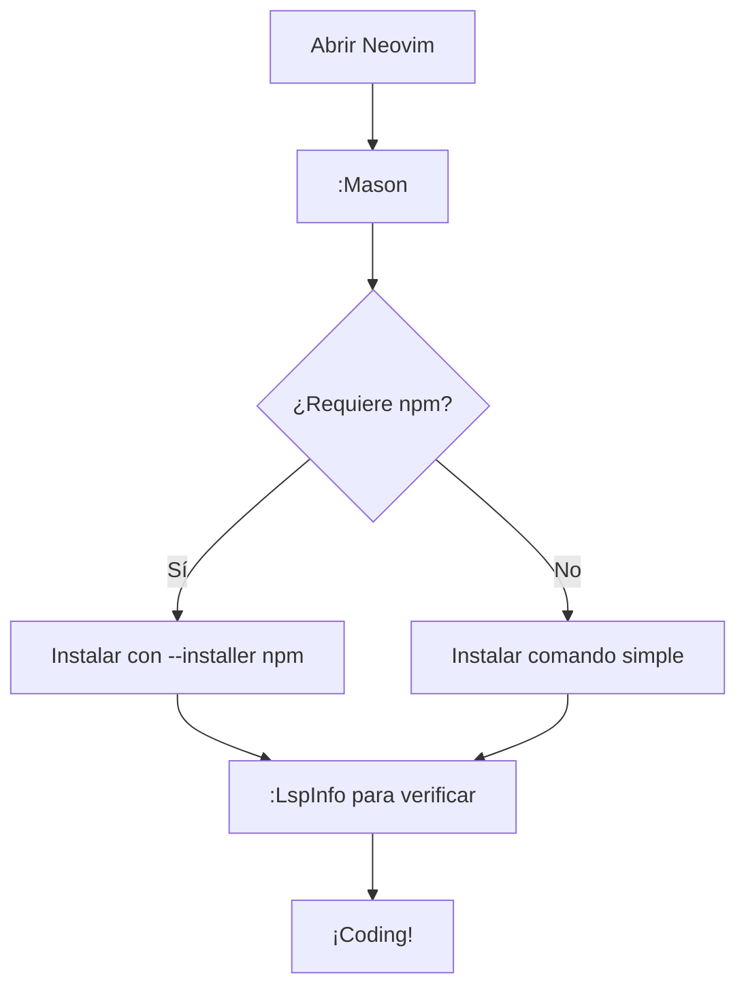

### **Guía Definitiva: Instalación de LSPs en NvChad **


#### 🔧 **PASO 1: Requisitos del sistema (Linux Mint/Ubuntu)**

```bash
# 1. Instalar Node.js y npm (ESENCIAL)
sudo apt update && sudo apt install nodejs npm -y

# 2. Verificar instalación:
node --version  # Debe mostrar v14+
npm --version   # Debe mostrar 6.14+
```


#### 🛠️ **PASO 2: Comandos clave en Neovim (NvChad)**

| **Acción**               | **Comando Neovim**                     |
|--------------------------|----------------------------------------|
| Abrir gestor de LSPs      | `:Mason`                               |
| Instalar LSP genérico    | `:MasonInstall <nombre>`               |
| Instalar LSP con npm     | `:MasonInstall --installer npm <nombre>` |
| Desinstalar LSP          | `:MasonUninstall <nombre>`             |
| Ver LSPs activos         | `:LspInfo`                             |
| Forzar reinstalación     | `:MasonInstall --force <nombre>`       |
| Actualizar todos los LSPs| `:MasonUpdate`                         |


#### 📦 **Tabla de LSPs Esenciales (Comandos Específicos)**

| **Lenguaje** | **Nombre LSP**      | **Tipo**  | **Comando Correcto**                          |
|--------------|---------------------|-----------|-----------------------------------------------|
| Python       | `pyright`           | npm       | `:MasonInstall --installer npm pyright`       |
| JavaScript   | `tsserver`          | npm       | `:MasonInstall --installer npm tsserver`      |
| Lua          | `lua_ls`            | binario   | `:MasonInstall lua_ls`                        |
| HTML         | `html-lsp`          | binario   | `:MasonInstall html-lsp`                      |
| CSS          | `css-lsp`           | binario   | `:MasonInstall css-lsp`                       |
| C/C++        | `clangd`            | binario   | `:MasonInstall clangd`                        |
| Rust         | `rust_analyzer`     | binario   | `:MasonInstall rust_analyzer`                 |
| Bash         | `bashls`            | binario   | `:MasonInstall bashls`                        |
| Markdown     | `marksman`          | binario   | `:MasonInstall marksman`                      |


#### 🐍 **Ejemplo Práctico: Configurar Python**

```bash
# Terminal:
sudo apt install python3-venv  # Opcional: para entornos virtuales

# Dentro de Neovim:
:MasonInstall --installer npm pyright
```

**Verificación:**

1. Crea un archivo `test.py`
2. Escribe `print("Hola")`
3. Ejecuta `:LspInfo` → Debe mostrar "pyright" activo.


#### ⚠️ **Soluciones para Errores Comunes**

| **Error**                                  | **Solución**                          |
|--------------------------------------------|---------------------------------------|
| `npm failed with exit code`                | Ejecutar `sudo apt install npm --reinstall` |
| `LSP not starting`                         | `:LspRestart` + verificar `:LspInfo` |
| `No se detecta el LSP en el archivo`       | Revisar extensión del archivo (.py, .js) |
| `Comandos Mason no funcionan`              | Actualizar NvChad: `:NvChadUpdate`   |


#### 🔄 **Flujo de Trabajo Recomendado**




#### 💾 **Notas Clave para Obsidian**

```markdown
## Directorios Importantes
- LSPs instalados: `~/.local/share/nvim/mason/packages/`
- Logs de errores: `:MasonLog`

## Consejos Pro
1. **Siempre instala npm primero**:  
   `sudo apt install nodejs npm -y`
2. **Para LSPs basados en npm**:  
   Usar siempre `--installer npm`
3. **Si trabajas en modo live**:  
   Instala LSPs en cada sesión o usa USB persistente
```

#### ✅ **Verificación Final**

```bash
# En Neovim:
:checkhealth mason
```

Debe mostrar:

```
mason: require("mason.health").check()
========================================================================
## mason.nvim report
- OK: neovim version >= 0.8.0
- OK: **npm** is available
- OK: **python3** is available
...
```


